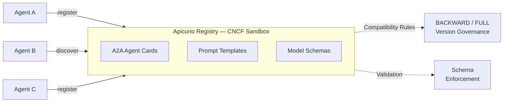

# From OpenAPI to Agent Cards — Governing AI Discovery with Open Standards

A live demonstration of **AI agent discovery and governance** using [Apicurio Registry](https://www.apicur.io/registry/) (CNCF sandbox project) and the [A2A (Agent-to-Agent) Protocol](https://google.github.io/A2A/).

Presented at **API Days Amsterdam 2026** and **FOST Munich 2026**.

## Overview

OpenAPI standardized how we describe REST APIs. AsyncAPI did the same for event-driven architectures. Now the A2A Protocol brings that same open-standards approach to AI agents — structured capability declarations, typed interfaces, and machine-readable discovery. This project demonstrates how the same registry that governs your OpenAPI and AsyncAPI definitions now manages AI-native artifacts:

- **A2A Agent Cards** — Structured capability declarations for agent discovery
- **Prompt Templates** — Version-controlled prompts with compatibility rules
- **Model Schemas** — JSON Schema validation for ML model metadata

## Architecture



### Pipeline Flow

1. **Agent Registration** — Agents register their A2A Agent Cards (capabilities, skills, endpoints) in the registry
2. **Prompt Governance** — Prompt templates are stored as versioned artifacts with BACKWARD compatibility rules
3. **Model Schema Validation** — ML model metadata is validated against registered JSON Schemas
4. **Agent Discovery** — Agents query the registry to discover peers by capability, replacing hardcoded service URLs

## Prerequisites

- Docker and Docker Compose
- `curl` and `jq`

## Quick Start

```bash
# Start Apicurio Registry
docker compose up -d

# Wait for registry to be ready
./scripts/wait-for-registry.sh

# Run the full demo
./scripts/run-demo.sh
```

## Demo Scripts

| Script | Purpose |
|--------|---------|
| `scripts/01-register-agents.sh` | Register 3 A2A Agent Cards (Summarizer, Translator, Data Enrichment) |
| `scripts/02-register-prompts.sh` | Register prompt templates with BACKWARD compatibility versioning |
| `scripts/03-register-model-schemas.sh` | Register model metadata JSON Schema + sample model |
| `scripts/04-discover-agents.sh` | Query the registry for agent discovery |
| `scripts/05-breaking-change.sh` | Demonstrate compatibility rule enforcement (rejected breaking change) |
| `scripts/06-start-agents.sh` | Build and start real A2A agents (Summarizer + Orchestrator) with Ollama |
| `scripts/07-live-agent-demo.sh` | Live demo: orchestrator discovers and delegates to summarizer via registry |
| `scripts/run-demo.sh` | Run all governance demo steps end-to-end |
| `scripts/wait-for-registry.sh` | Wait for Apicurio Registry to be healthy |
| `scripts/cleanup.sh` | Tear down all containers |

## Real A2A Agents

Beyond the curl-based governance demo, this repo includes two real Quarkus agents:

| Agent | Path | Description |
|-------|------|-------------|
| **Summarizer** | `agents/summarizer/` | A2A server that summarizes text via Ollama. Auto-publishes its Agent Card to the registry on startup. |
| **Orchestrator** | `agents/orchestrator/` | Discovers agents via the Apicurio Registry, delegates tasks using the A2A Protocol. Uses the `quarkus-langchain4j-a2a-apicurio-registry` extension. |

Both agents use **Ollama** with `qwen2.5:1.5b` for fast, self-contained LLM inference.

## Schemas

| File | Description |
|------|-------------|
| `schemas/agent-card-schema.json` | JSON Schema for A2A Agent Card structure |
| `schemas/model-metadata-schema.json` | JSON Schema for ML model metadata |
| `schemas/prompt-template-schema.json` | JSON Schema for prompt template structure |

## Registry UI

After starting, open http://localhost:8080 to browse registered artifacts:

- **`ai-agents`** group — A2A Agent Cards
- **`prompts`** group — Prompt Templates with version history
- **`model-schemas`** group — Model Metadata and validation schemas

## Key Concepts

### Why Registry-Based Agent Discovery?

| Approach | Problem |
|----------|---------|
| Hardcoded URLs | Agents break when endpoints change |
| DNS/Service mesh | Discovers services, not capabilities |
| A2A well-known endpoint | Requires knowing the host first |
| **Registry-backed discovery** | Agents query by capability, skills, or input/output modes |

### Prompt Template Compatibility

Apicurio Registry enforces compatibility rules on prompt template versions:

- **Adding** an optional variable (with default) → **BACKWARD compatible** ✓
- **Removing** a required variable → **Breaking change** ✗ (rejected by registry)
- **Renaming** a variable → **Breaking change** ✗ (rejected by registry)

### The Open Standards Arc: OpenAPI → AsyncAPI → A2A

The same governance patterns that protect OpenAPI specs, AsyncAPI definitions, and Kafka schemas now protect AI artifacts:

- **Versioning** — Every change creates a new version
- **Compatibility checking** — Breaking changes are caught before production
- **Lifecycle management** — Artifacts can be deprecated and eventually disabled
- **Search and discovery** — Agents find each other by querying the registry

## Technology Stack

| Component | Technology |
|-----------|------------|
| Agent Registry | [Apicurio Registry 3.x](https://www.apicur.io/registry/) (CNCF sandbox) |
| Agent Protocol | [A2A Protocol](https://google.github.io/A2A/) (Agent-to-Agent) |
| Agent Framework | [Quarkus LangChain4j](https://docs.quarkiverse.io/quarkus-langchain4j/dev/) with A2A Apicurio Registry extension |
| LLM Runtime | [Ollama](https://ollama.ai/) with qwen2.5:1.5b |
| API Standards | [OpenAPI](https://www.openapis.org/), [AsyncAPI](https://www.asyncapi.com/) (also governed by the same registry) |
| Schema Format | JSON Schema (draft 2020-12) |
| Container Runtime | Docker / Podman |

## License

Apache License 2.0 — see [LICENSE](LICENSE).
