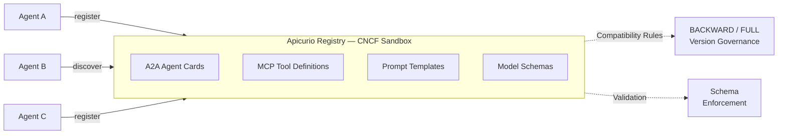

# Governing AI Discovery with Open Standards

A live demonstration of **AI agent and tool discovery** using [Apicurio Registry](https://www.apicur.io/registry/) (CNCF sandbox project), the [A2A (Agent-to-Agent) Protocol](https://google.github.io/A2A/), and the [MCP (Model Context Protocol)](https://modelcontextprotocol.io/).

## Overview

OpenAPI standardized how we describe REST APIs. AsyncAPI did the same for event-driven architectures. Now the A2A Protocol brings that same open-standards approach to AI agents — structured capability declarations, typed interfaces, and machine-readable discovery. This project demonstrates how the same registry that governs your OpenAPI and AsyncAPI definitions now manages AI-native artifacts:

- **A2A Agent Cards** — Structured capability declarations for agent discovery
- **MCP Tool Definitions** — MCP server registration and dynamic tool discovery
- **Prompt Templates** — Version-controlled prompts with compatibility rules
- **Model Schemas** — JSON Schema validation for ML model metadata

## Architecture



### Pipeline Flow

1. **Agent Registration** — Agents register their A2A Agent Cards (capabilities, skills, endpoints) in the registry
2. **Prompt Governance** — Prompt templates are stored as versioned artifacts with BACKWARD compatibility rules
3. **Model Schema Validation** — ML model metadata is validated against registered JSON Schemas
4. **Agent Discovery** — Agents query the registry to discover peers by capability, replacing hardcoded service URLs

## Prerequisites

- Docker and Docker Compose
- `curl` and `jq`

## Quick Start

```bash
# Start Apicurio Registry, Registry UI, and Ollama
docker compose up -d apicurio-registry apicurio-registry-ui ollama

# Wait for registry to be ready
./scripts/wait-for-registry.sh

# Run the governance demo (curl-based scripts)
./scripts/run-demo.sh

# Start the real agents (builds Docker images, pulls Ollama model)
./scripts/06-start-agents.sh

# Open the orchestrator dashboard for A2A flows:
#   "Summarize the benefits of open standards" → routes to Summarizer
#   "Translate to French: Hello world" → routes to Translator
open http://localhost:10020

# Try the MCP weather flow (via /chat endpoint):
curl -s -X POST http://localhost:10020/chat \
  -H "Content-Type: text/plain" \
  -d "What is the weather in Amsterdam?"
```

## Demo Scripts

| Script | Purpose |
|--------|---------|
| `scripts/02-register-prompts.sh` | Register prompt templates with BACKWARD compatibility versioning |
| `scripts/03-register-model-schemas.sh` | Register model metadata JSON Schema + sample model |
| `scripts/05-breaking-change.sh` | Demonstrate compatibility rule enforcement — variable type changes and removals are rejected (HTTP 409) |
| `scripts/06-start-agents.sh` | Build and start real A2A agents (Summarizer + Orchestrator) with Ollama |
| `scripts/07-live-agent-demo.sh` | Live demo: orchestrator discovers and delegates to summarizer via registry |
| `scripts/run-demo.sh` | Run all governance demo steps end-to-end |
| `scripts/wait-for-registry.sh` | Wait for Apicurio Registry to be healthy |
| `scripts/cleanup.sh` | Tear down all containers |

## Real Agents

Beyond the curl-based governance demo, this repo includes four Quarkus services:

| Agent | Path | Port | Description |
|-------|------|------|-------------|
| **Summarizer** | `agents/summarizer/` | 10010 | A2A server that summarizes text via Ollama. Auto-publishes its `AGENT_CARD` via `@PublishToAgentRegistry`. |
| **Translator** | `agents/translator/` | 10030 | A2A server that translates text between languages via Ollama. Auto-publishes its `AGENT_CARD` via `@PublishToAgentRegistry`. |
| **MCP Weather** | `agents/mcp-weather/` | 10040 | MCP server providing weather data for European cities. Self-registers its `MCP_TOOL` artifact in the registry on startup. |
| **Orchestrator** | `agents/orchestrator/` | 10020 | Unified orchestrator with two endpoints: `/orchestrate` for A2A agent delegation (with dashboard UI), `/chat` for MCP tool discovery and execution. |

Agents use **Ollama** — `qwen2.5:1.5b` for summarizer/translator, `qwen2.5:7b` for the orchestrator (better tool-calling reliability).

### How It Works

**A2A flow** (`POST /orchestrate`):
1. Reads `AGENT_CARD` artifacts from the registry (via the Apicurio Registry SDK, enriched with each Agent Card's skills — not exposed by the `AgentsRegistry` SPI)
2. Narrows candidates by matching request keywords against each card's skills client-side (the registry can't search nested skill data)
3. LLM picks the best match from the narrowed candidates
4. Delegates the task via `AgenticServices.a2aBuilder(...)` (`langchain4j-agentic-a2a`) — the real A2A client, no hand-rolled JSON-RPC

**MCP flow** (`POST /chat`):
1. LLM calls `searchMcpServers("weather")` → finds Weather MCP Server in registry
2. LLM calls `connectMcpServer("weather-mcp-server", "mcp-servers")` → connects via Streamable HTTP
3. LLM calls `callMcpTool("mcp-servers/weather-mcp-server", "getWeather", '{"city":"Amsterdam"}')` → returns weather data

Both flows use the same Apicurio Registry as the single source of truth for all AI capabilities.

> **Known upstream issue:** as merged, `ApicurioAgentsRegistry#allAgents()` builds each `AgentInstance` via `AgenticServices.a2aBuilder(url).outputKey(name).build()` without calling `.inputKeys(...)`, which throws for the `UntypedAgent` case and is swallowed by the registry's own try/catch — so `allAgents()`/`getAgent()` currently return no agents even when they're reachable ([quarkiverse/quarkus-langchain4j#2796](https://github.com/quarkiverse/quarkus-langchain4j/issues/2796)). The orchestrator still injects `ApicurioAgentsRegistry` and calls `allAgents()` (logged, not relied upon), reads Agent Card artifacts directly via the registry SDK for skill matching, and calls `AgenticServices.a2aBuilder(...).inputKeys("input")...build()` itself for delegation, which works around the bug while still using the same official A2A client.
>
> **A2A SDK compatibility:** `AgenticServices.a2aBuilder(...)`'s client (`org.a2aproject.sdk`, spec 1.0+) only understands Agent Cards with a `supportedInterfaces` field, and has no fallback to the older `additionalInterfaces`/`preferredTransport` shape produced by A2A "0.3" servers ([a2aproject/a2a-java#1121](https://github.com/a2aproject/a2a-java/issues/1121)). The Summarizer and Translator agents were migrated from `io.github.a2asdk` (0.3.x) to `org.a2aproject.sdk` (1.0.0.Final) — same `PublicAgentCard`/`AgentExecutor` CDI producer model, package renamed from `io.a2a.*` to `org.a2aproject.sdk.*`, `TaskUpdater` replaced by `AgentEmitter` — so both sides of the demo now speak the current A2A spec end-to-end.

## Schemas

| File | Description |
|------|-------------|
| `schemas/agent-card-schema.json` | JSON Schema for A2A Agent Card structure |
| `schemas/model-metadata-schema.json` | JSON Schema for ML model metadata |
| `schemas/prompt-template-schema.json` | JSON Schema for prompt template structure |

## Web UIs

| UI | URL | Description |
|----|-----|-------------|
| **Registry UI** | http://localhost:8888 | Browse artifacts: Agent Cards, Prompt Templates, Model Schemas |
| **Orchestrator Dashboard** | http://localhost:10020 | Live agent discovery and delegation flow with payload inspection |
| **A2A Discovery** | http://localhost:8080/.well-known/agents | A2A well-known endpoint listing all registered agents |

### Registry UI Groups

- **`a2a-agents`** — A2A Agent Cards self-registered by the live agents via `@PublishToAgentRegistry` (`AGENT_CARD` type)
- **`mcp-servers`** — MCP Tool Definitions (`MCP_TOOL` type)
- **`prompts`** — Prompt Templates with version history (`PROMPT_TEMPLATE` type)
- **`model-schemas`** — Model Metadata (`MODEL_SCHEMA` type)

### Orchestrator Dashboard

The dashboard at http://localhost:10020 shows each step of the orchestration flow in real-time:

1. **Discover Agents** — Registry SDK query results (artifact IDs, names, types)
2. **Inspect Agent Card** — Full A2A Agent Card JSON (skills, capabilities, URL)
3. **Search by Skill** — Client-side keyword match against each card's skills (the registry only indexes flat metadata, not the nested skills array) to narrow the candidates before asking the LLM
4. **Select Best Agent** — LLM router picks the best match from the narrowed candidates
5. **Delegate via A2A** — Real A2A client (`AgenticServices.a2aBuilder`, `langchain4j-agentic-a2a`) request/response payloads
6. **Result** — LLM-generated response with timing data

Click any step to inspect its payload in the detail panel.

## Key Concepts

### Why Registry-Based Agent Discovery?

| Approach | Problem |
|----------|---------|
| Hardcoded URLs | Agents break when endpoints change |
| DNS/Service mesh | Discovers services, not capabilities |
| A2A well-known endpoint | Requires knowing the host first |
| **Registry-backed discovery** | Agents query by capability, skills, or input/output modes |

### Prompt Template Compatibility

Apicurio Registry enforces compatibility rules on `PROMPT_TEMPLATE` versions:

- **Adding** an optional variable (with default) → **BACKWARD compatible** ✓
- **Changing** a variable type (integer → string) → **Breaking change** ✗ (HTTP 409)
- **Removing** a variable still used in the template → **Breaking change** ✗ (HTTP 409)

### The Open Standards Arc: OpenAPI → AsyncAPI → A2A

The same governance patterns that protect OpenAPI specs, AsyncAPI definitions, and Kafka schemas now protect AI artifacts:

- **Versioning** — Every change creates a new version
- **Compatibility checking** — Breaking changes are caught before production
- **Lifecycle management** — Artifacts can be deprecated and eventually disabled
- **Search and discovery** — Agents find each other by querying the registry

## Technology Stack

| Component | Technology |
|-----------|------------|
| Agent Registry | [Apicurio Registry 3.3.0](https://www.apicur.io/registry/) (CNCF sandbox) |
| Agent Protocol | [A2A Protocol](https://google.github.io/A2A/) (Agent-to-Agent) |
| Tool Protocol | [MCP](https://modelcontextprotocol.io/) (Model Context Protocol) |
| A2A Discovery | [quarkus-langchain4j-a2a-apicurio-registry](https://github.com/quarkiverse/quarkus-langchain4j) — `@PublishToAgentRegistry` + `ApicurioAgentsRegistry` |
| MCP Discovery | [quarkus-langchain4j-mcp-apicurio-registry](https://github.com/quarkiverse/quarkus-langchain4j) — `searchMcpServers` + `connectMcpServer` + `callMcpTool` |
| A2A SDK | [org.a2aproject.sdk](https://github.com/a2aproject/a2a-java) 1.0.0.Final — current A2A spec, client + reference JSON-RPC server |
| Agent Framework | [Quarkus](https://quarkus.io/) + [Quarkus LangChain4j](https://docs.quarkiverse.io/quarkus-langchain4j/dev/) |
| LLM Runtime | [Ollama](https://ollama.ai/) — qwen2.5:7b (orchestrator), qwen2.5:1.5b (agents) |
| API Standards | [OpenAPI](https://www.openapis.org/), [AsyncAPI](https://www.asyncapi.com/) (also governed by the same registry) |
| Container Runtime | Docker / Podman |

> Both the A2A ([#2501](https://github.com/quarkiverse/quarkus-langchain4j/pull/2501)) and MCP ([#2338](https://github.com/quarkiverse/quarkus-langchain4j/pull/2338)) Apicurio Registry discovery extensions have been merged upstream into `quarkus-langchain4j`. This demo builds against the `999-SNAPSHOT` development version until they ship in a tagged release.

## License

Apache License 2.0 — see [LICENSE](LICENSE).
